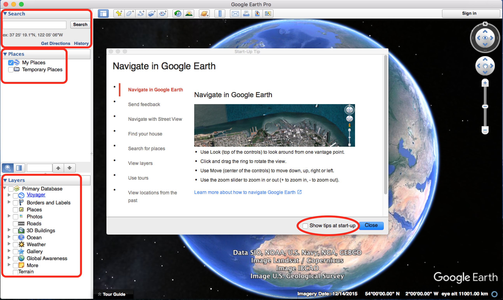
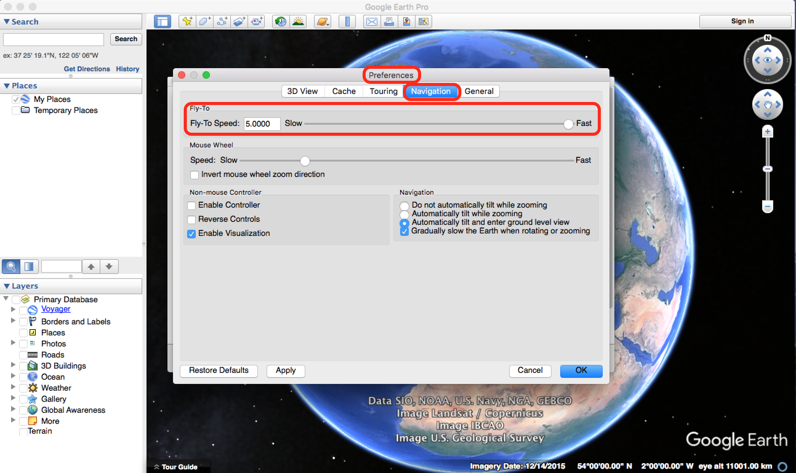
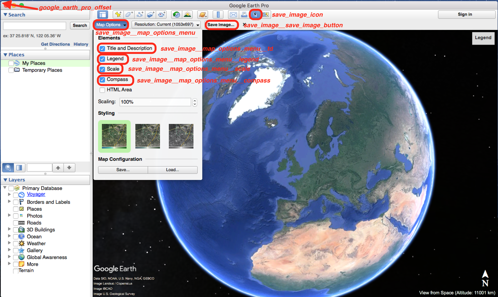
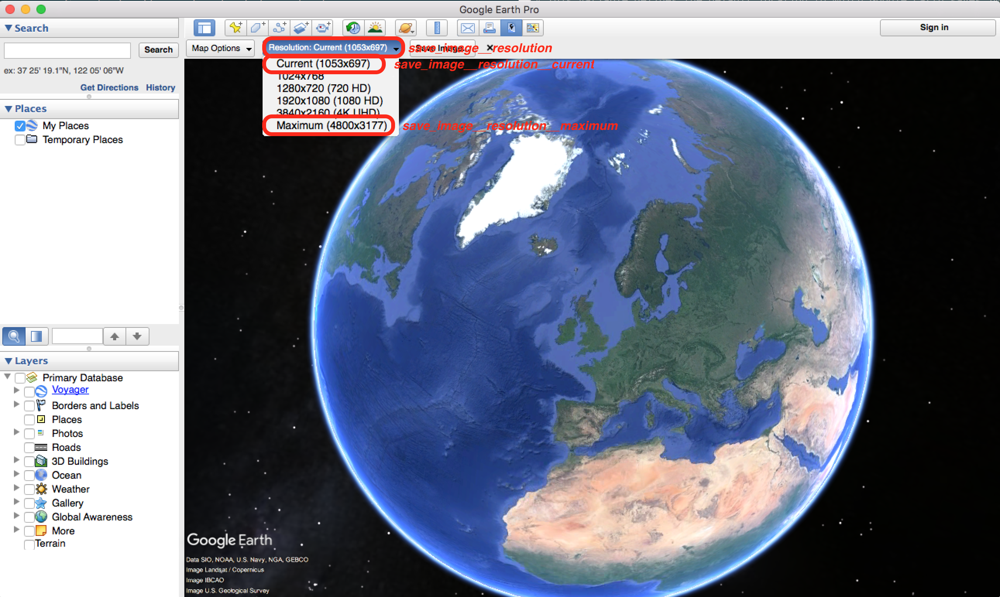
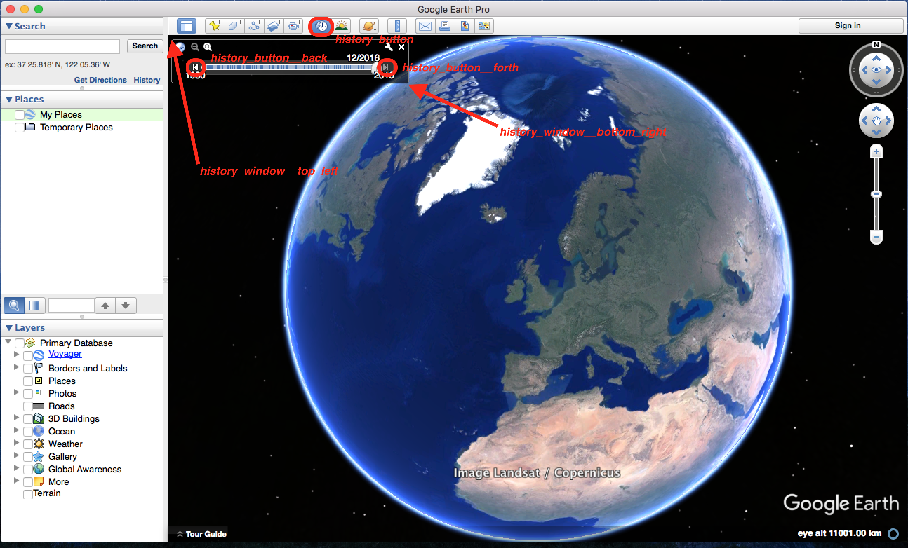
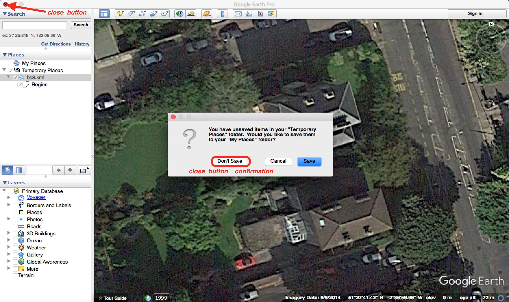

# xCave #
Google Earth Pro building extraction with history

## Installation ##
Required version of Python is 2. If you're using Python *virtual environments* do:
```
mkvirtualenv xCave
workon xCave
pip install -r requirements.xxx.txt
```

Otherwise do:
```
pip install --user -r requirements.xxx.txt
```

Where `xxx` is `osx` or `linux` depending on your operating system. If you're using Mac OS X installing *Xcode* first is required.

Then, due to its internal structure, Python's `PyAutoGUI` has to be installed separately:
```
pip install PyAutoGUI==0.9.36
```

Ubuntu requires a couple of additional packages:
```
sudo apt-get install scrot
sudo apt-get install python-tk
sudo apt-get install python-dev
sudo apt-get install python-imaging-tk
sudo apt-get install python-numpy
sudo apt-get install python-scipy
sudo apt-get install python-xlib
```

---

If you just want to use *image alignment* module it's enough to install Python `Pillow` package:
```
pip install Pillow==3.4.2
```

## xCave configuration ##
Before `xCave` can be used it needs to be configured. Open `xCave.conf` with your favourite text editor and set the following values:
* `os` -- line 15
* `version` -- line 19
* `resolution` -- line 33
* `executable_path` -- line 38
* `save_location` -- line 43

Their meaning and possible values are explained in detail inline in the `xCave.conf` file. Please note that the explanations and comments will disappear from this file once Google Earth gets calibrated.

## Google Earth configuration ##
### Configure Google Earth interface ###
- Uncheck *Show tips at start-up*
- Make sure that *Search* tab is opened
- Uncheck all *Places*
- Uncheck all *Layers*



### Configure Google Earth speed ###
- In `Preferences --> Navigation` set *Fly-To speed* to maximum
- Now *maximize* Google Earth window to fit most of your screen space



### Configure Google Earth save image ###



### Configure Google Earth history ###
When resizing the window make sure that history panel fits into the screen.



### Configure Google Earth exit ###


## Usage ##
The software has the following commandline options:
```
$ ./xCave.py -h
usage: xCave.py [-h] [-c | -i IMAGERY [IMAGERY ...] | -o OSM | -k KLM
                [KLM ...] | -g GEOLOCATE GEOLOCATE | -a ALIGN | -p APPLY
                APPLY]

Google Earth Pro imagery extractor.

optional arguments:
  -h, --help            show this help message and exit
  -c, --calibrate       Calibrate Google Earth Pro interface.
  -i IMAGERY [IMAGERY ...], --imagery IMAGERY [IMAGERY ...]
                        Download Google Earth Pro imagery from specified KML
                        file or a folder with KML files. If second argument
                        (integer) is provided the imagery will be downloaded
                        from given image number onwards (steps down the Google
                        Earth history).
  -o OSM, --osm OSM     Download region file from OpenStreet Maps. This option
                        requires a string of 4 values restricting the region:
                        "left bottom top right".
  -k KLM [KLM ...], --klm KLM [KLM ...]
                        Convert given OSM file into KLM file. The first
                        argument is a path to an OSM file or a directory
                        containing OSM files. The second optional argument is
                        a list of points of interest; 5 objects close to each
                        point will be extracted and saved as a separate KLM
                        file e.g. "(27.703625,85.309184); (27.703474,
                        85.310344)".
  -g GEOLOCATE GEOLOCATE, --geolocate GEOLOCATE GEOLOCATE
                        Geolocate image in an OSM file or a set of OSM files.
                        The first argument is OSM file or a folder containing
                        OSM files; the second argument is an image to be geo-
                        located.
  -a ALIGN, --align ALIGN
                        Invoke GUI to align images in given directory.
  -p APPLY APPLY, --apply APPLY APPLY
                        Apply alignment to images in given directory (the
                        first argument is *alignment file* and the second is
                        *directory* with images).
```

Usecase:
```
./xCave.py -h

./xCave.py -c

./xCave.py -o "85.307 27.702 85.312 27.705"

./xCave.py -k ./85.307_27.702_85.312_27.705.osm "(27.703625,85.309184); (27.703474,85.310344)"
# or ./xCave.py -k 85.307_27.702_85.312_27.705.osm
# or ./xCave.py -k ./osms/

./xCave.py -i 85.307_27.702_85.312_27.705_objects/112654809.kml
# or ./xCave.py -i 85.307_27.702_85.312_27.705_objects/112654809.kml 7
# or ./xCave.py -i 85.307_27.702_85.312_27.705_objects/

./xCave.py -g 85.307_27.702_85.312_27.705.osm _test_data/WP_20161010_075.jpg
# or ./xCave.py -g osm_test/ _test_data/WP_20161010_075.jpg

./xCave.py -a 85.307_27.702_85.312_27.705_objects/111823094

./xCave.py -p 85.307_27.702_85.312_27.705_objects/111823094/111823094.clb 85.307_27.702_85.312_27.705_objects/111823094
./xCave.py -p 85.307_27.702_85.312_27.705_objects/111823094/111823094.clb 85.307_27.702_85.312_27.705_objects/112654809/
```

Where `-i` opens Google Earth and controls mouse and keybord to download the imagery, and `-a` opens GUI to align this imagery. The GUI invoked with `-a` uses the following keyboard shortcuts:
* `q` to quit the application,
* `<up-arrow>` to move the image one pixel up,
* `<down-arrow>` to move the image one pixel down,
* `<left-arrow>` to move the image one pixel left,
* `<right-arrow>` to move the image one pixel right,
* `<return>`(`<enter>`) to accept the allignment and go to the next image.
